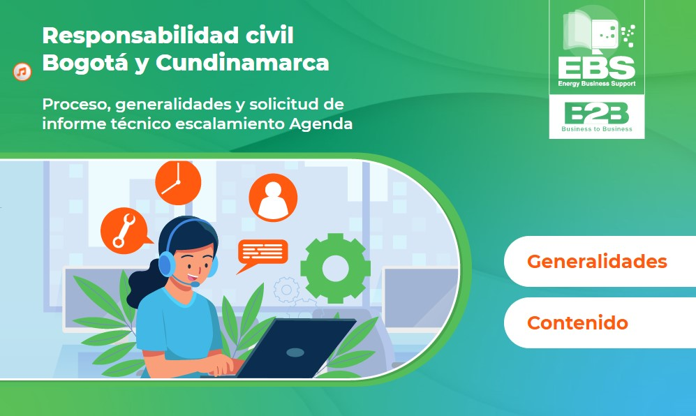
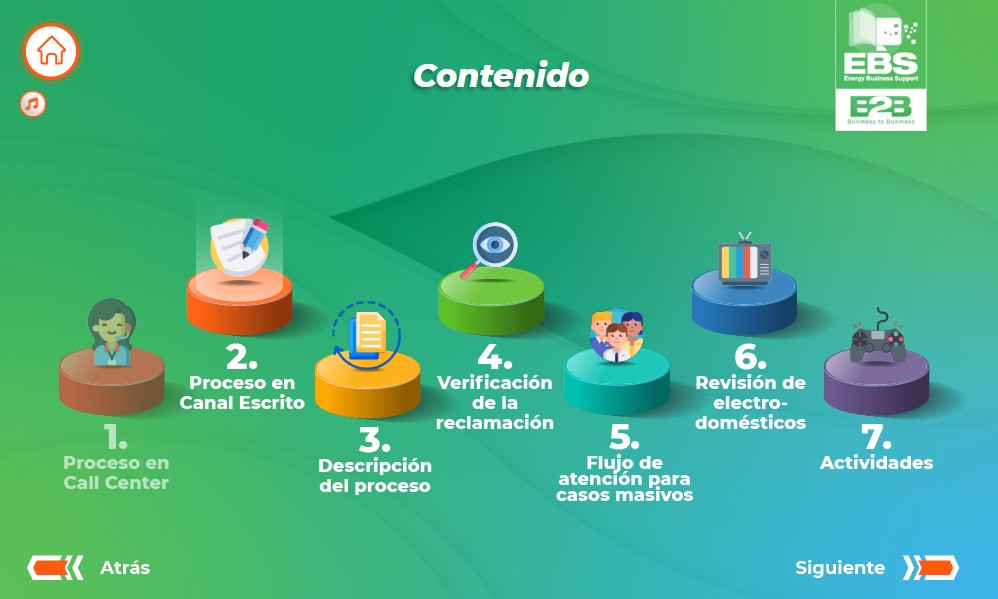
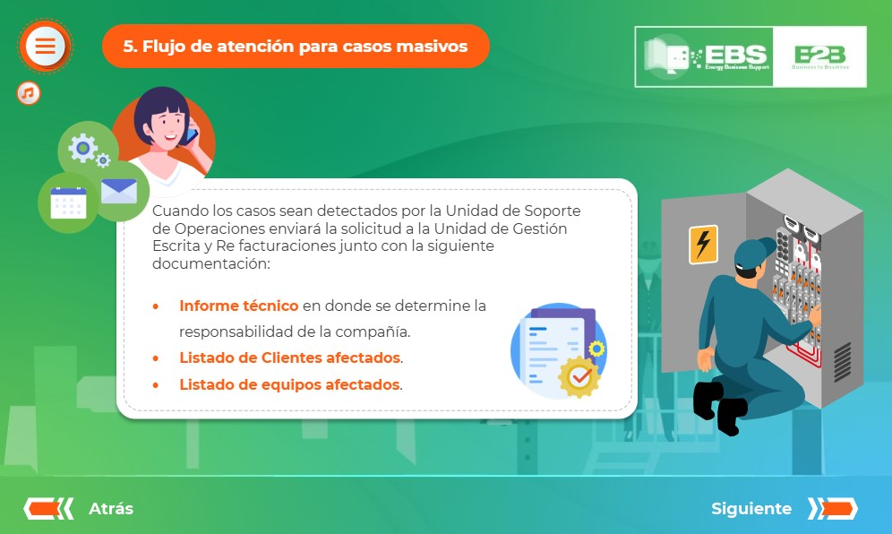

# 🚀 Capacitación de empresas

## 📌 Descripción

Recurso interactivo de aprendizaje. Un producto destinados a la capacitación de distintos temas en empresas.

---

## 🛠️ Tecnologías utilizadas

- **Storyline 360**
- **JavaScript (ES6+)**

---

## 📸 Capturas de pantalla

---

## 🚀 Demo en vivo

👉 [Ver proyecto en GitHub Pages](https://ivan-develops.github.io/ResponsabilidadCivil_ENEL/)

---
